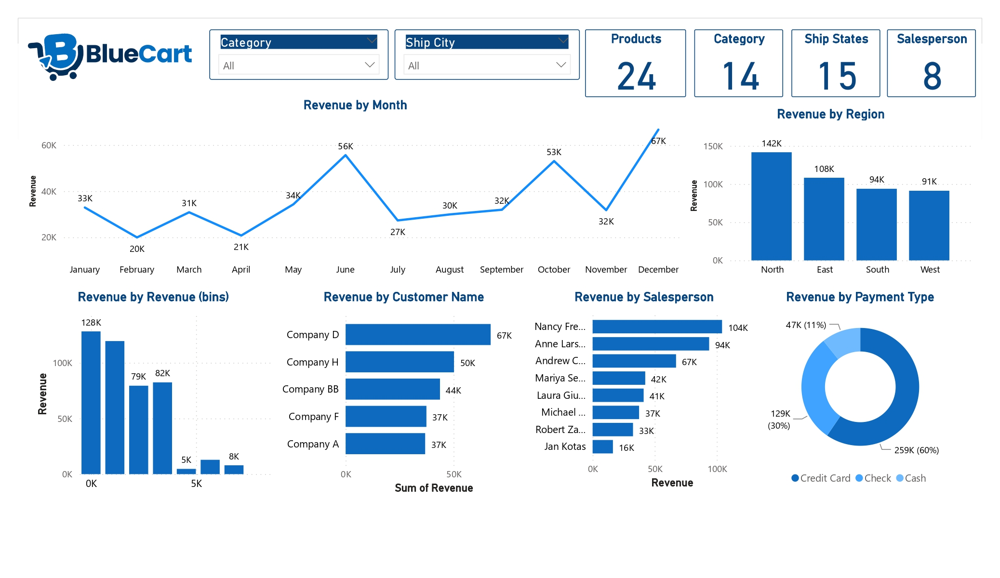
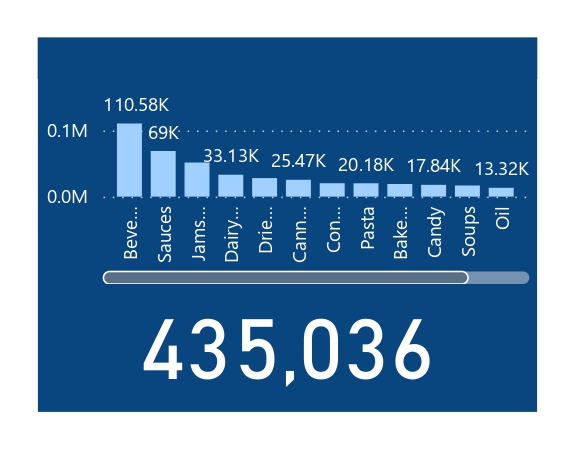

## BlueCart Sales Analytics

The "BlueCart Sales Analytics" report provides a comprehensive overview of sales data for the BlueCart company using various Power BI visualizations. The report is designed to help the company identify trends and opportunities for improvement in their sales operations.

The first section of the report provides a summary of total sales data for the company. This information is presented in a clustered column chart, which shows sales by month for the selected time period. The chart effectively highlights the company's top-performing months, as well as months with lower sales. The chart can be filtered by year to allow for further analysis.

The next section of the report provides sales data by product category. The data is presented in a stacked column chart, which shows the contribution of each product category to the total sales for the selected time period. The chart allows the company to identify their most popular product categories and to adjust their inventory and marketing strategies accordingly.

The third section of the report provides sales data by state. The data is presented in a choropleth map, which shows the sales data by state using color coding. The map allows the company to identify which states have the highest sales and to focus their sales efforts in those regions.

The fourth section of the report provides sales data by customer type. The data is presented in a pie chart, which shows the percentage of sales from each customer type. The chart allows the company to understand which customer types are most valuable to their business and to tailor their marketing strategies accordingly.

The fifth section of the report provides sales data by salesperson. The data is presented in a donut chart, which shows the sales data by salesperson. The chart allows the company to identify their top-performing salespeople and to incentivize them accordingly.

The final section of the report provides a summary of key performance indicators (KPIs) in the form of cards. The KPIs include total sales, sales growth, average order value, and customer acquisition cost. The cards provide a quick overview of the company's performance and allow the company to monitor their progress towards their goals.

Overall, the "BlueCart Sales Analytics" report provides a comprehensive overview of sales data for the company and allows the company to identify trends and opportunities for improvement. The visualizations are effective in communicating the data and provide a user-friendly interface for analysis.

## Trends Identified 

1. Seasonal trends: The clustered column chart of total sales data shows that the company experiences higher sales during certain months of the year, indicating a seasonal trend in customer demand.

2. Popular product categories: The stacked column chart of sales by product category shows which product categories are most popular with customers, allowing the company to focus their marketing efforts and inventory management accordingly.

3. Regional sales trends: The choropleth map of sales by state shows which states have the highest sales, allowing the company to focus their sales efforts in those regions.

4. Valuable customer types: The pie chart of sales by customer type shows which customer types generate the highest sales, allowing the company to tailor their marketing strategies and customer acquisition efforts accordingly.

Top-performing salespeople: The donut chart of sales by salesperson shows which salespeople generate the highest sales, allowing the company to incentivize and reward their top performers.

By identifying these trends, the company can make informed decisions about their sales operations, such as adjusting inventory levels, focusing sales efforts in certain regions, and incentivizing top-performing salespeople.

## Opportunities

1. Increase sales during slower months: The clustered column chart of total sales data shows that the company experiences lower sales during certain months of the year. The company could develop marketing strategies or promotions to boost sales during those slower months.

2. Optimize inventory management: The stacked column chart of sales by product category shows which product categories are most popular with customers. The company could adjust their inventory levels to ensure they have enough stock of their top-selling products while reducing inventory of low-selling products.

3. Expand sales in underperforming states: The choropleth map of sales by state shows which states have lower sales. The company could develop targeted sales strategies to increase sales in those regions, such as offering promotions or partnering with local businesses.

4. Increase customer acquisition: The pie chart of sales by customer type shows which customer types generate the highest sales. The company could develop targeted marketing strategies to attract more of those valuable customer types.

5. Improve salesperson performance: The donut chart of sales by salesperson shows which salespeople generate the highest sales. The company could provide training or coaching to underperforming salespeople or incentivize top performers to continue performing well.

By addressing these areas for improvement, the company can increase their sales and profitability, as well as improve customer satisfaction and loyalty.
